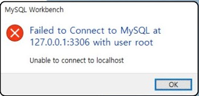
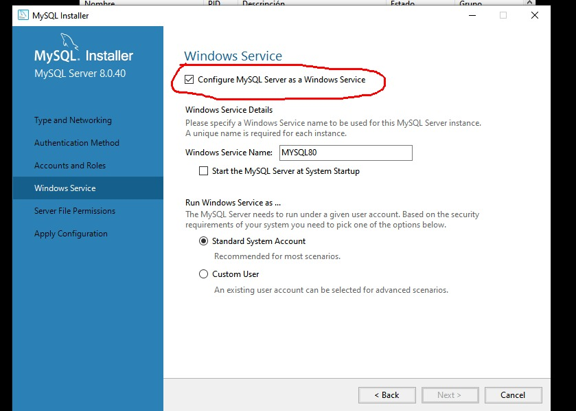

### Notas:<br>

Usamos MySQL Server 8

---

``npm install`` para actualizar los paquetes

---

Para conectar una db y hacer pruebas locales, podemos ejecutar el backend ejecutando el NPM Script ``start``. Esto actualizará todas las dependencias y luego se nos pedirá ingresar el root password que hayamos elegido cuando instalamos MySQL. 

Este password se pide en tiempo de ejecución para no tener que subir contraseñas al repositorio público.

La configuración de la db se puede hacer desde el archivo [flags.js](Planify_Api/flags.js), donde podremos establecer los parámetros de conexión a nuestra db, permitiendonos así conectarnos a una db ya creada, o crear una nueva llamada ``basedepruebas`` acorde a las sentencias en el [script con todas las sentencias sql.](Planify_Api/basedepruebas.sql) La constante ``ExecuteSQLSentences`` en [flags.js](Planify_Api/flags.js) va a definir si creamos la db o nos conectamos a una ya existente.

Si está en true, y ejecutamos el proyecto, esto borrará la db de pruebas (llamada ``basedepruebas``) si ya existía y creará una nueva a partir de los datos que estén en el [script con todas las sentencias sql](Planify_Api/basedepruebas.sql) y esto nos permitirá al equipo usar una db ficticia para el desarrollo del proyecto y tenerla así cargada en el repositorio. Las sentencias se ejecutarán en orden, y el orden de ejecución es importante, así que hay que cuidar de no incluír datos que dependan de otros datos que aún no se crearon. <br><br>
Por ejemplo:
* Definiciones de tablas con FOREIGN_KEYS de otras tablas que aún no se crearon
* Insertar objetos en tablas que aún no se crearon
* Insertar objetos con FOREIGN_KEYS de mentira. Los datos deben existir.

---

<a name="endpoints"></a>
## Endpoints

<a name="gets"></a>
### GETs
<a name="/api/estados"></a>
* ``/api/estados``: Devuelve un arreglo de estados que representan cada columna. No se requieren parámetros. La estructura devuelta es la siguiente:
    ```json
    [
        {
            "id_estado": 1,
            "orden": 0,
            "nombre": "Backlog"
        },
        // ...
    ]
    ```
<a name="/api/estados/tareas"></a>
* ``/api/estados/tareas``: Devuelve un arreglo de objetos que sirven para rellenar la escena principal, en la que vemos los estados, que representan las columnas, y las miniaturas de las tareas que hay en cada tarea, con los usuarios asignados. No se requieren parámetros. La estructura devuelta es la siguiente:
    ```json
    [
        {
            "id_estado": 1,
            "Nombre": "Backlog",
            "id_tarea": 1,
            "nombre": "Mejorar el diseño del home",
            "descripcion": "Cambiar la distribución de los botones en la parte...",
            "Nombre_apellido": "Juan Pérez"
        },
        // ...
    ]
    ```
<a name="/api/board"></a>
* ``/api/board``: Devuelve un objeto que sirve para mostrar todos los datos necesarios para la vista general del tablero de trabajo, en la que podremos ver, todos los estados/columnas, y una breve información sobre cada tarea en ese estado/columna para mostrar en miniatura. No se requieren parámetros. La estructura devuelva es la siguiente:

    ```json
    {
        "estados": [
            {
                "id_estado": 1,
                "nombre": "Backlog",
                "orden": 0,
                "tareas": [
                    {
                        "id_tarea": 1,
                        "nombre": "Tarea 1",
                        "prioridad": null,
                        "orden": 0,
                        "usuarios": [
                            1,
                            3
                        ]
                    },
                    {
                        "id_tarea": 2,
                        //...
                    }
                ]
            },
            {
                "id_estado": 2,
                //...
            },
            //...
        ]
    }
    ```

> [!IMPORTANT]
> El valor: **prioridad** de las tareas puede ser ``null`` o ``undefined``, esto significaría lo mismo que prioridad 0 (o, en otras palabras, sin ninguna estrellita)

<a name="/api/task/:id"></a>
* ``/api/task/:id``: Devuelve los datos en detalle de una tarea específica. La petición se realiza con un parámetro id que es un entero y debe coincidir con el PK de la tarea que estamos buscando.

    Por ejemplo:<br>
    ``https://.../api/task/5``

    La estructura devuelta debería ser similar a esta:

    ```json
    {
        "id_tarea": 5,
        "nombre": "Cambiar el diseño del popup de salida",
        "descripcion": "Hay que repensar los colores y la distribución de los botones en el popup que aparece cuando...", // Puede no existir esta propiedad
        "fecha_creacion": "2024-12-01T19:20:02.000Z",
        "fecha_limite": null, // Puede no existir, de hacerlo, sería en el mismo formato que la fecha de creación
        "orden": 3,
        "prioridad": null, // Puede no existir, sería lo mismo que 0
        "id_estado": 1,
        "usuarios": [ // Puede ser un arreglo vacío
            1,
            3
        ]
    }
    ```

> [!IMPORTANT]
> Los valores: **descripcion**, **fecha_limite** y **prioridad** pueden ser ``null`` o ``undefined``

> [!CAUTION]
> Si ingresamos cualquier otro valor, o el id buscado no corresponde a ninguna tarea, nos encontraremos con un error

<a name="/api/users"></a>
* ``/api/users``: Usado para obtener un listado con datos públicos de todos los usuarios. No se requieren parámetros. La estructura devuelta es la siguiente:

    ```json
    [
        {
            "id_usuario": 1,
            "nombre": "Juan",
            "apellido": "Pérez",
            "foto_perfil": null
        },
        {
            "id_usuario": 2,
            //...
        },
        //...
    ]
    ```
> [!IMPORTANT]
> El valor: **foto_perfil** puede ser ``null`` o ``undefined``

<a name="/api/user/:id"></a>
* ``/api/user/:id``: Devuelve los datos públicos de un usuario específica. La petición se realiza con un parámetro id que es un entero y debe coincidir con el PK del usuario que estamos buscando.

    Por ejemplo:<br>
    ``https://.../api/user/3``

    La estructura devuelta debería ser similar a esta:

    ```json
    {
        "id_usuario": 3,
        "nombre": "Luis",
        "apellido": "García",
        "foto_perfil": null
    }
    ```

> [!IMPORTANT]
> El valor: **foto_perfil** puede ser ``null`` o ``undefined``

> [!CAUTION]
> Si ingresamos cualquier otro valor, o el id buscado no corresponde a ningún usuario, nos encontraremos con un error

<a name="post"></a>

### POSTs

<a name="/api/newregister"></a>
* ``/api/newregister``: Usado para crear un nuevo usuario. La petición se debe realizar con los siguientes valores dentro del body:
    * ``correo``: Debe ser un string con el formato ``a@a.a`` de hasta 250 caracteres de largo.
    * ``nombre``: Debe ser un string que contenga entre 3 y 100 caracteres y que no contenga números.
    * ``apellido``: Debe ser un string que contenga entre 3 y 100 caracteres y que no contenga números.
    * ``password``: Debe ser un string que tenga al menos 8 caracteres.

    Con esos parámetros crearemos un nuevo usuario. En el proceso, podemos obtener o un estado de error 400 con explicación correspondiente, si es que algo salió mal, o un estado 201 si todo salió bien. Y la estructura devuelta sería la siguiente:
    ```json
    {
        "id_usuario": 4,
        "correo": "juan.perez@gmail.com",
        "nombre": "Juan",
        "apellido": "Perez"
    }
    ```
<a name="/api/newstate"></a>
* ``/api/newstate``: Usado para crear un nuevo estado para las tareas, lo cual se representa por medio de columnas. La petición se debe realizar con los siguientes valores dentro del body:
    * ``nombre``: El nombre del estado/columna, debe ser un string de al menos 1 y hasta 50 caracteres de largo. Pueden ser números.
    * ``orden``: Un entero que nos servirá para elegir la ubicación de la columna en el tablero. Las columnas deberán ser ordenadas moviendo a la derecha las que tengan los números mas altos.

    Con esos parámetros crearemos un nuevo estado/columna. En el proceso, podemos obtener o un estado de error 400 con explicación correspondiente, si es que algo salió mal, o un estado 201 si todo salió bien. Y la estructura devuelta sería la siguiente:
    ```json
    {
        "id_estado": 5,
        "nombre": "Testing",
        "orden": "5"
    }
    ```
 <a name="/api/newtask"></a>
* ``/api/newtask``: Usado para crear una nueva tarea. La petición se debe realizar con los siguientes valores dentro del body:
    * ``nombre``: El título de la tarea, debe ser un string de al menos 1 y hasta 100 caracteres de largo. Pueden ser números.
    * ``orden``: Un entero que nos servirá para elegir la ubicación de la tarea en la columna. Las tareas deberán ser ordenadas moviendo abajo a las que tengan los números mas altos.
    * ``id_estado``: Una clave foránea (FK) que representa el id del estado en la tabla estados.

    Con esos parámetros crearemos una nueva tarea. En el proceso, podemos obtener o un estado de error 400 con explicación correspondiente, si es que algo salió mal, o un estado 201 si todo salió bien. Y la estructura devuelta sería la siguiente:
    ```json
    {
        "id_tarea": 5,
        "nombre": "Hacer algo importante",
        "orden": "3",
        "id_estado": 1,
        "fecha_creacion": "2024-11-28 15:30:00"
    }
    ```
 <a name="patch"></a>
### PATCHs

 <a name="/api/updatestate"></a>
* ``/api/updatestate``: Usado para modificar un estado/columna. La petición se debe realizar con los valores detallados a continuación dentro del body. Cabe destacar que hay parámetros opcionales, pero la petición debe tener al menos uno de los parámetros opcionales:
    * ``id_estado``: Un entero que representa la PK del estado/columna a modificar.
    * ``nombre`` (opcional): El nombre del estado/columna, debe ser un string de al menos 1 y hasta 50 caracteres de largo. Pueden ser números.
    * ``orden`` (opcional): Un entero que nos servirá para elegir la ubicación de la columna en el tablero. Las columnas deberán ser ordenadas moviendo a la derecha las que tengan los números mas altos. 

    Con esos parámetros modificaremos un estado/columna. En el proceso, podemos obtener o un estado de error 400 con explicación correspondiente, si es que algo salió mal, o un estado 200 si todo salió bien. Y la estructura devuelta sería igual a la estructura proporcionada.
 <a name="/api/updatetask"></a>
* ``/api/updatetask``: Usado para modificar una tarea. La petición se debe realizar con los valores detallados a continuación dentro del body. Cabe destacar que hay parámetros opcionales, pero la petición debe tener al menos uno de los parámetros opcionales:
    * ``id_tarea``: Un entero que representa la PK de la tarea a modificar.
    * ``nombre`` (opcional): El título de la tarea, debe ser un string de al menos 1 y hasta 100 caracteres de largo. Pueden ser números.
    * ``descripcion`` (opcional): La descripción de la tarea a realizar. Debe ser un string de hasta 250 caracteres de largo. Pueden ser números.
    * ``fecha_limite`` (opcional): La fecha límite de la tarea a realizar. Debe ser un objeto de tipo Date.
    * ``orden`` (opcional): Un entero que nos servirá para elegir la ubicación de la tarea en la columna. Las tareas deberán ser ordenadas moviendo abajo a las que tengan los números mas altos.
    * ``prioridad`` (opcional): Un entero que nos servirá para elegir el nivel de prioridad de esta tarea. Basicamente, es la cantidad de estrellitas en una tarea. Siendo 5 el máximo valor y 0 el mínimo.
    * ``id_estado`` (opcional): Una clave foránea (FK) que representa el id del estado en la tabla estados.
    * ``usuarios`` (opcional): Un arreglo de enteros que representa el id de los usuarios asignados a la tarea. Son FKs. La llamada al endpoint interpretará estos enteros y hará las modificaciones necesarias en la tabla usuarios_tareas para crear o eliminar las relaciones entre tareas y usuarios. Así que los enteros proporcionados deben ser FKs válidas.

    Con esos parámetros modificaremos una tarea. En el proceso, podemos obtener o un estado de error 400 con explicación correspondiente, si es que algo salió mal, o un estado 200 si todo salió bien. Y la estructura devuelta sería igual a la estructura devuelta al pedir esa tarea. Por ejemplo:

    ```json
    {
        "id_tarea": 5,
        "nombre": "Cambiar el diseño del popup de salida",
        "descripcion": "Hay que repensar los colores y la distribución de los botones en el popup que aparece cuando...", // Puede no existir esta propiedad
        "fecha_creacion": "2024-12-01T19:20:02.000Z",
        "fecha_limite": null, // Puede no existir, de hacerlo, sería en el mismo formato que la fecha de creación
        "orden": 3,
        "prioridad": null, // Puede no existir, sería lo mismo que 0
        "id_estado": 1,
        "usuarios": [ // Puede ser un arreglo vacío
            1,
            3
        ]
    }
    ```
 <a name="delete"></a>
### DELETEs

 <a name="/api/task/:id"></a>
* ``/api/task/:id``: Usado para eliminar una tarea en particular. La petición se realiza con un parámetro id que es un entero y debe coincidir con el PK de la tarea que estamos eliminando.

    En el proceso, podemos obtener o un estado de error 40X con la explicación correspondiente, si es que algo salió mal, o un estado 200 con un mensaje si la eliminación fue un éxito.

    La estructura devuelta puede ser similar a esta:

    ```json
    {
        "error": "There isn't any task with the id: 1", // Opcional
        "message": "Resource sucessfully deleted" // Opcional
    }
    ```
 <a name="/api/state/:id"></a>
* ``/api/state/:id``: Usado para eliminar un estado/columna en particular y todas las tareas relacionadas a él. La petición se realiza con un parámetro id que es un entero y debe coincidir con el PK del estado/columna que estamos eliminando.

    En el proceso, podemos obtener o un estado de error 40X con la explicación correspondiente, si es que algo salió mal, o un estado 200 con un mensaje si la eliminación fue un éxito.

    La estructura devuelta puede ser similar a esta:

    ```json
    {
        "error": "There isn't any state with the id: 1", // Opcional
        "message": "Resource sucessfully deleted" // Opcional
    }
    ```

---

Problemas: 
* Failed to Connect to MySQL at 127.0.0.1:3306 with user root.<br>
<br>
Solucion abrir el instalador de MySQL Server 8 y procurar tener activada esta opción:<br>
<br>

